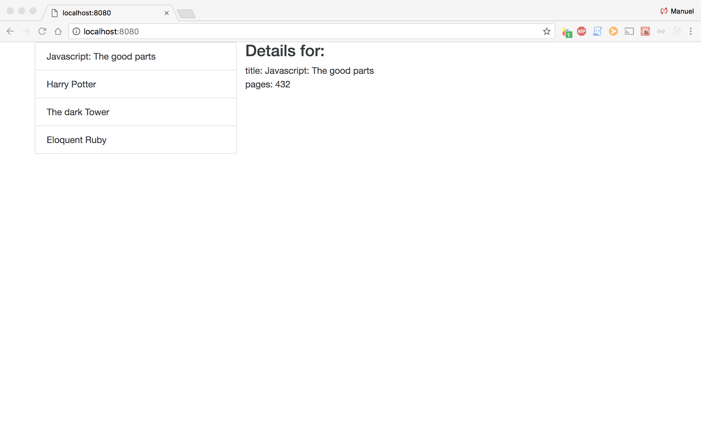

## Project Description:

This project recreates a basic bookshop interface. The books are fetched from the App state using Redux.

The project is done together with the great React and Redux turorial from Stephen Grider:

   [Modern React with Redux](https://www.udemy.com/react-redux/ "Modern React with Redux")

## Installing:

####  Dependencies

You need to have Node.js installed to run the project

[Download Node.js](https://nodejs.org/en/download/ "Download Node.js")

Check in linux terminal that package was installed properly

`node -v`

Check also npm is installed

`npm -v`

#### On linux terminal

1. In target directory clone the repository from gitHub

	` git clone https://github.com/manuelAlonsoPerez/bookshop_redux_basic.git`

2. Navigate to project folder

	`cd bookshop_redux_basic`

3. Install package

	`npm install`

4. Run project

	`npm start`

5.Open a new browser window and navigate to

    http://localhost:8080/

#### Alternatively

Download  .zip, .tar, .tar.gz or .tar compressed package, decompress it to target folder and follow from Step 2.

## Status

The  project is working and is possible to select different books. The books array is placed in the App state and accesed with Redux.

